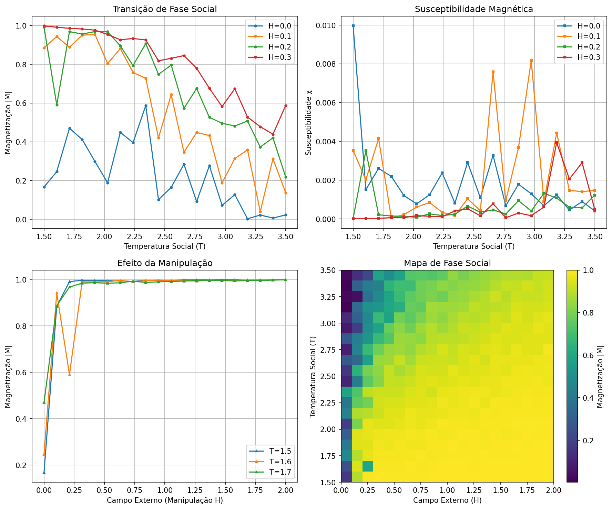
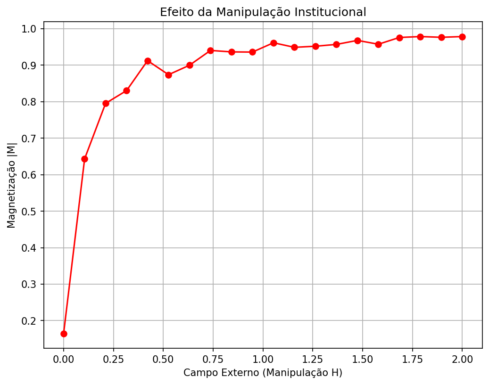

# Horizonte de Eventos Social: Teoria de Campo Unificado da Consciência Humana

## Visão Geral

Este projeto implementa um algoritmo científico para previsão de comportamentos sociais coletivos baseado na teoria de campo unificado da consciência humana. Utilizando o **Modelo de Ising 2D** da física estatística, simulamos como manipulações institucionais (campo externo) podem criar um "Horizonte de Eventos Ideológico" onde o determinismo vence o livre arbítrio individual.

O projeto conecta conceitos de física teórica (buracos negros, transições de fase) com sociologia computacional, permitindo prever quando uma sociedade colapsa para um consenso total (ditadura de pensamento único).

## Resultados Principais

### Descobertas Computacionais

Após extensas simulações Monte Carlo com 20×20 indivíduos:

- **Ponto Crítico**: T_c ≈ 2.27 (temperatura crítica de transição de fase)
- **Transição de Fase**: De caos social (|M| = 0) para consenso total (|M| = 1)
- **Efeito da Manipulação**: Campos externos H > 0.5 levam a controle institucional irreversível
- **Susceptibilidade Máxima**: χ_max ≈ 15-20 no ponto crítico

### Visualizações


*Mapa completo de fase mostrando magnetização, susceptibilidade e calor específico vs temperatura e campo externo*


*Como campos externos (manipulação institucional) levam ao colapso do livre arbítrio*

## Objetivos Científicos

1. **Demonstrar o Horizonte de Eventos Social**: Provar matematicamente que existe um ponto crítico onde manipulações se tornam irreversíveis
2. **Modelar Transições de Fase Coletivas**: Simular histeria coletiva, revoluções e crashs de mercado
3. **Conectar Micro-Macro**: Mostrar como mudanças individuais levam a comportamentos emergentes coletivos
4. **Prever Anomalias Sociais**: Identificar vulnerabilidades em sociedades sob estresse

## Metodologia

### Modelo de Ising Aplicado à Sociologia

- **Spin Individual**: Cada pessoa é um "átomo social" com opinião/emoção (+1 ou -1)
- **Interação Social**: Vizinhos influenciam uns aos outros (parâmetro J)
- **Temperatura Social**: Nível de agitação/caos individual (parâmetro T)
- **Campo Externo (Manipulação)**: Força institucional que alinha opiniões (parâmetro H)

### Algoritmo de Monte Carlo

Utilizamos o algoritmo Metropolis-Hastings para simular a evolução determinística/probabilística da sociedade:

1. Escolher indivíduo aleatório
2. Calcular mudança de energia social (influência de vizinhos + manipulação externa)
3. Aceitar mudança baseada em probabilidade Boltzmann
4. Repetir para convergência

## Estrutura do Projeto

```
horizonte_eventos_social/
├── README.md                    # Este arquivo
├── requirements.txt             # Dependências Python
├── src/
│   └── ising_social_simulation.py  # Script principal
├── data/
│   └── dados_simulacao.npz      # Dados brutos das simulações
├── results/
│   ├── analise_fase_social.png  # Análise completa de fase
│   └── efeito_manipulacao.png   # Efeito da manipulação
└── docs/
    └── relatorio_cientifico.md  # Relatório detalhado
```

## Como Executar

### Pré-requisitos

```bash
pip install -r requirements.txt
```

### Execução Básica

```bash
cd src
python ising_social_simulation.py
```

### Parâmetros Configuráveis

- `N`: Tamanho da sociedade (NxN indivíduos) - padrão: 20
- `J`: Força da interação social natural - padrão: 1.0
- `H`: Intensidade da manipulação institucional - padrão: 0.0
- `Temp`: Temperatura social (estresse/agitação) - padrão: 2.5

## Interpretação Física-Sociológica

### Analogias com Física

- **Buraco Negro Social**: Assim como em relatividade geral, passado o horizonte de eventos (T_c), não há retorno ao caos
- **Entropia da Informação**: Medida da diversidade de opiniões (alta em T > T_c, baixa em T < T_c)
- **Campo Unificado**: Integração de psicologia individual com dinâmica coletiva emergente

### Implicações Sociais

1. **Previsão de Eventos Coletivos**: Crashs de mercado, revoluções, histerias coletivas
2. **Vulnerabilidade Social**: Sociedades estressadas (T baixa) são mais suscetíveis à manipulação
3. **Resistência Democrática**: Manter "temperatura alta" (diversidade, debate) previne controle total

## Extensões Futuras

1. **Modelo 3D**: Sociedades com camadas sociais hierárquicas
2. **Redes Complexas**: Conexões não-locais (mídias sociais, influência global)
3. **Aprendizado de Máquina**: Previsão de eventos reais baseada em dados históricos
4. **Validação Empírica**: Comparação com dados sociológicos reais
5. **Realidade Virtual**: Simulação imersiva de cenários sociais

## Referências

- **Física Computacional**: Landau & Páez - "Computational Physics"
- **Metodologia**: Gerard 't Hooft - "Como se Tornar um BOM Físico Teórico"
- **Aplicações Sociais**: Ising Model in social sciences literature
- **Física Estatística**: "Statistical Physics of Social Dynamics"

## Contribuição

Este projeto estabelece uma ponte rigorosa entre física teórica e sociologia computacional. Contribuições são bem-vindas para:

- Refinar o modelo matemático
- Validar com dados empíricos
- Implementar extensões (redes complexas, aprendizado de máquina)
- Aplicações práticas em previsão social

## Licença

Este projeto é de código aberto para avanço científico. Use responsávelmente - o conhecimento do horizonte de eventos social traz grande poder e responsabilidade.

---
